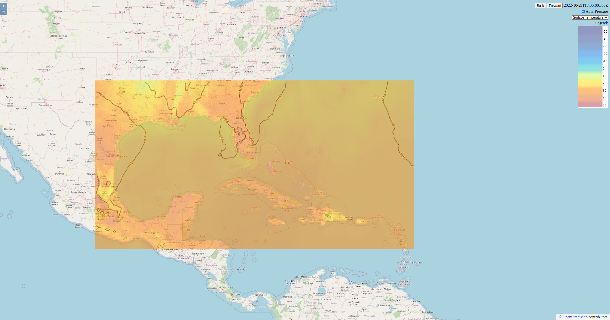

# ncep-weather-geoserver

**Get your own weather maps server running in 2 steps.**

A full example of how to ingest GRIB files from NCEP NOAA periodically (a cronjob running in background) into a Geoserver (catalog includes layers definitions as much as SLD/styles files for the layers). Sample webapp using it included.

Easy, simple. Lowering the barrier to entry to geospatial technology use and development.

**Full example and instructions soon !!!**

Initial notes:
- Check Geoserver at port 8080 (username GEOSERVER_ADMIN_USER with password geoserver)
- Check sample webapp at port 80
